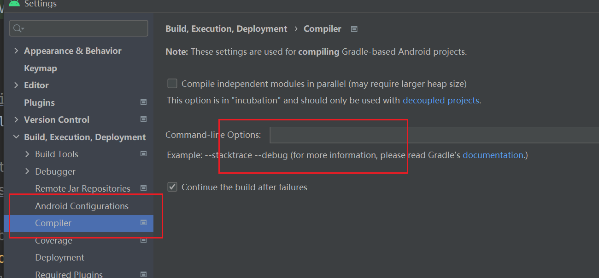

### 注意事项

1、 KSPLogger默认情况下不会输出info的日志到控制台， 需要对gradle开启 `--info`参数才可以， 或者直接使用KSPLogger.warn 去打印， 默认会输出参数， KSPLogger.error同样会打印，但是会终止编译过程

开启方式：

- IDE全局开启 

  
  
  

2、 由于缓存等原因会导致不会执行KSP， 这时候尝试rebuild一下

3、 `clean`的时候， 貌似会存在 `lib_annotation` 模块被缓存、无法删除， 无视它即可  项目：https://github.com/RicardoJiang/ksp-butterknife 也存在同样的问题（不知道为啥）

```
Unable to delete directory 'C:\Android\ksp-butterknife\butterknife-annotation\build'
  Failed to delete some children. This might happen because a process has files open or has its working directory set in the target directory.
  - C:\Android\ksp-butterknife\butterknife-annotation\build\libs\butterknife-annotation.jar
  - C:\Android\ksp-butterknife\butterknife-annotation\build\libs
```

4、 Moshi等项目配置时，会出现报错`default compatibility` 相关的错误， 在对应模块添加如下kts配置（不清楚它对应的grovvy语法) 

```
tasks.withType<KotlinCompile> {
    kotlinOptions.freeCompilerArgs += "-Xjvm-default=all-compatibility"
}
```

 貌似是kotlin语法支持的问题

```
fun interface SymbolProcessorProvider {
    /**
     * Called by Kotlin Symbol Processing to create the processor.
     */
    fun create(environment: SymbolProcessorEnvironment): SymbolProcessor
}
```


5、 KSP是可以解析Java中的注解的， 具体的原理不清楚， 我猜测是其使用了类似Kapt的兼容技术独立处理Java文件、 然后通过Api兼容了一下

